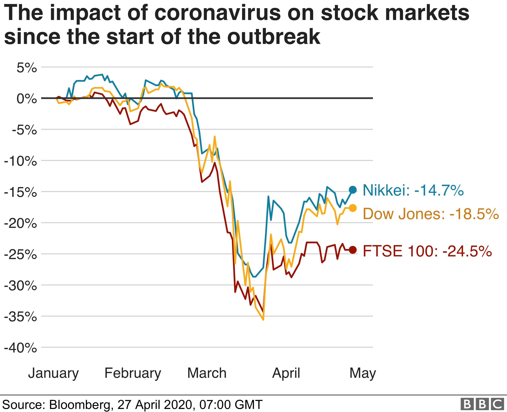
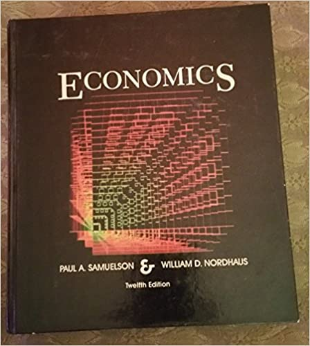
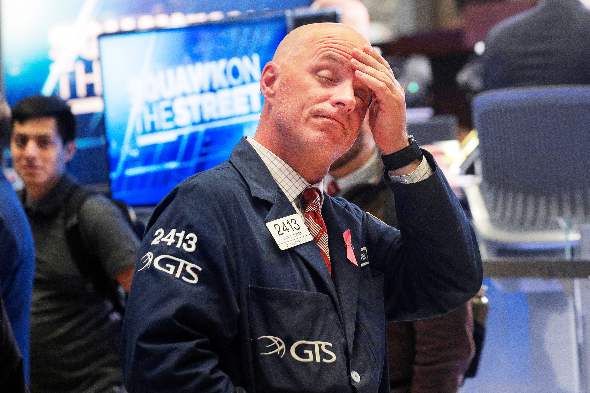

# Economics: the master of disaster

### Shenzhen Philosophy Group
#### May 16, 2020

---
## Contents

* The sun comes up: The world of today
* We plant some seeds
* Our real back-breaking toil for the day
* We sit on the back porch and just REMEMBER
* Everything goes wrong
* We harvest our plants: A simple econ model
* Addendum

---
### Our new reality

----

----
#### But what IS THAT?

* Stock markets are hemmoraging cash, what does that mean?
* What is the stock market?
* Business? Finance? Economy?
* When are things going to go back to normal?

---
## Let's get this party started

### First, some ground rules

----
### There's just too much for me to cover here in two hours

Economics is really a broad topic, look to some book recommendations at the end
if you're interested

----
### I'm talking about what is, not what should be

> Positive statements vs normative statements

----
### Your spending is my income, and vice versa

__Spending comes first__, income follows

----
### Anyone can create money, the problem is getting it accepted

----
### Economics is a social science

Social science has a problem, you don't get to run large scale experiments (unless you have a navy)

----
### SS has only one proven tenet

If a person's salary depends on them not understanding something, they'll find a way to do it
> Upton Sinclair Principle

----
### Trades are two-sided

> Every debt is someone else's asset, and vice versa

----
### Some definitions

* GDP - market value of goods and services
* Bank - an entity that borrows short and lends long
* Money - something that is accepted as payment
* Credit - a promise to make payment
* Stock - a partial share of company profits
* Bond - a promise to repay money X at time Y
* Interest rate - the cost of borrowing money

---
# Our Day's Labour

## Conquer Econ

###### Eeeppp
----
### So we crack open our textbook, what do we find?

----
## Two separate things

| Macro | Micro |
|:------|:------|
| Domestic Economies  | Individual people/firms |
| Empirical/Keynesian | Axiomatic/Neoclassical  |
| Y = C + I + G + (X-M) | R = P * Q; MC = MR    |
| Aggregates          | Marginal                |
| Zoomed-out          | Zoomed-in               |

----
## Who are the actors

* Households/individuals
* Firms/companies
* Governments
* Banks
* Other countries

---
## Let's remember some guys

| Econ-type | What a normal day looks like |
|:---------|:-------------|
| Classical | Nothing, they're all dead      |
| Marxist   | Criticizing capitalism         |
| Freshwater| Writing papers, being rational |
| Saltwater | Writing papers with crazy hard math |
| Austrian  | Shitposting; no good scotsman |
| Behavioural | Doing experiments, writing papers |

----
### Classical (Neoclassical)
* David Ricardo
* Adam Smith
* Jean-Baptiste Say

----
### Marxist
* John Roemer
* David Harvey
* Nikolai Bukharin

----
### Chicago School (Monetarists, Freshwater)
* Milton Friedman
* George Stigler
* Eugene Fama

----
### Keynesian (New/Neo/Post-Keynesian)
* Paul Samuelson
* Joseph Stiglitz
* Paul Krugman

----
### Austrian (fixed exchange rate view)
* Carl Menger
* Ludwig von Mises
* Murray Rothbard
* Friedrich Hayek (sorta)

----
### Behavioural
* Dan Ariely
* Robert Thaler
* Amos Tversky and Daniel Kahneman

---
## Past crises

| Episode            | CofG   | Effect       | Winners |
| -------- |-------|-------------|---------:|
| Panic of 1907 |US|Europe/Asia/Latin|Neoclassical |
| Great Depression |US|World|Keynesian |
| Oil Crisis |World|World|Freshwater |
| 1998 Asian  | Japan | Asia/Europe/Latin | China    |

----
### Panic of 1907

- Financial innovation leads to speculative bubble
- No central bank, no ability to add liquidity to a seized payments system
- JP Morgan (Mr. Moneybags) bails out several trusts and forces bankers to pool funds to save the NYSE

----
The Panic of 1907 originated with runs on a type of financial intermediary that was mostly outside the payments system, trust companies.  Similar to modern “shadow” banks, trust companies grew rapidly and became important financial intermediaries in the years prior to the crisis.1  Less regulated than commercial banks, trust companies were highly levered, held low cash reserve balances, and issued uninsured liabilities.

- https://altcoopsys.org/wp-content/uploads/2016/11/Financial-Crisis-1907-Federal-Reserve-Act-JP-Morgan-Carola-Paper.pdf

----
### The fix is in

1913 Federal Reserve act creates the US Federal Reserve banks, 12 regional banks that act as a "lender of last resort"

----
### Lesson from 1907

> Lack of liquidity kills you quick

----
### Great Depression

- Speculative bubble in securities, crash in 1929
- Government pulls back spending post-crash
- Fear, retreat to safety. People hoard gold
- Gold rises in value, dis-inflation. Why spend today, when your money will buy more tomorrow?

----
### What about the Fed?

- Fed actions were uncoordinated
- Raised interest rates to kill stock speculation, leading to 
money scarcity (excess of discipline)
- Liquidationist policy: let bad institutions fail so that better insts can be created (Mellon)

----
 From the fall of 1930 through the winter of 1933, the money supply fell by nearly 30 percent. The declining supply of funds reduced average prices by an equivalent amount. This deflation increased debt burdens; distorted economic decision-making; reduced consumption; increased unemployment; and forced banks, firms, and individuals into bankruptcy. 

 - https://www.federalreservehistory.org/essays/great_depression

----
### The fix this time?

> WWII, ever heard of it?

----
### Lesson from the great depression

> An economic crisis can lead to a political crisis. Remember, in the long
run we're all dead

----
### Oil Crisis

- Post-war institutions breakdown, capital strike
- Strange combination of low growth, high inflation
- Capital goes on strike, why invest when there's no possiblity of a return?

----
### 1998 Asian Crisis

- Hot money comes in, hot money goes out
- US deficits down, no worldwide safe asset
- Money goes to Asian seeking big returns, things start to wobble
- Retreat to safety

----
### 2008 Great Financial Crisis

- Financial innovation blows up again, speculative bubble based on "irrational exuberance"

---
# Reality Check

Remember the talk about the latest stock market crash. Watch MSNBC and 
they'll say that "wealth is being destroyed", is that right?

----
## Buyers and Sellers

* More people currently want to sell stocks than buy stocks: prices are down
* Companies have less working capital, sellers have more cash on hand
* The expected future profitability of stocks drops due to crash in the real economy (this time)

----

----
## Why does it matter?

* For most people, it simply doesn't
* Even for a particular company - they can fund themselves many different ways (stock market, bond market, bank loans, retained earnings, government handouts, etc)
* The stock market is huge and has a real consequence to the real economy, but it's not even the largest part of the capital market (which is itself much smaller than money markets)

----
#### Why do we think it matters then?

# How else do you keep everyone in a state of cat-like readiness?

----
#### What's the purpose of all this stuff?

With human nature being what it is: we are ultra-social primates with moral/cognitive empathy that dissipates as a function of social distance. We care about family, community, country, creed, and some vague notion of all being human, roughly in that order. What type of story do you need to tell in order to get a species that would be perfectly happy sitting on the beach eating coconuts in the majority of times when life is good, that they constantly need to be building amazing feats of technical brilliance to increase our hold over mother nature? What feeling do you need to put into people?

----
# Panic / Complacency

---
### The greatest financial lesson of all time

> MONOPOLY

----
# TWISTED TO MY ENDS