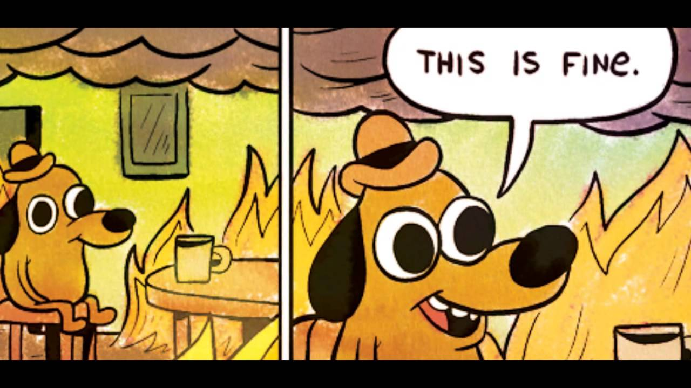
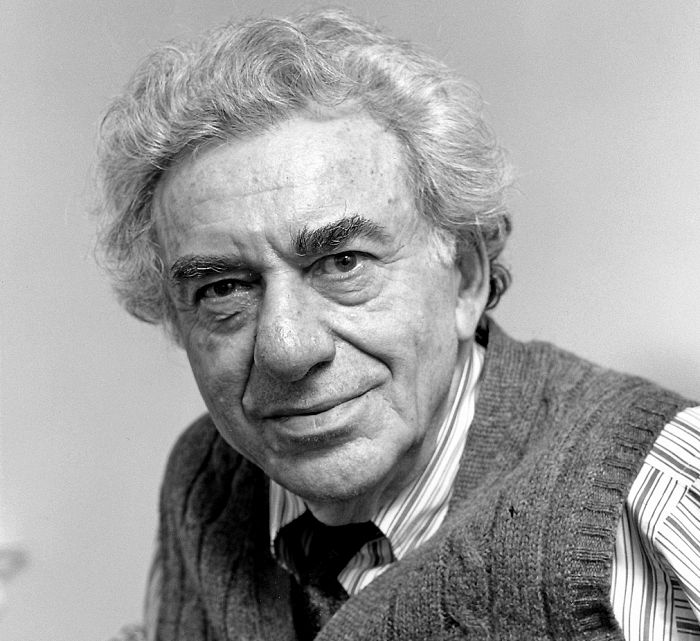

# Economics in Times of Panic

### Shenzhen Philosophy Group
#### April 16, 2020

---

## Contents

* Why? What are we doing here?
* Crises past
* This crisis
* Addendum (personal)

---

### Our new reality

---

## Let's get this party started

### First, some ground rules

----

### I'm talking about what is, not what should be

----

### Your spending is my income, and vice versa

__Spending comes first__, income follows

----

### Anyone can create money, the problem is getting it accepted

----

### Economics is a social science

Social science has a problem, you don't get to run large scale experiments (unless you have a navy)

----

### SS has only one proven tenet

If a person's salary depends on them not understanding something, they'll find a way to do it
> Upton Sinclair Principle

---

## Past crises

| Episode            | Type | CofG   | Effect       | Winners |
| -------- |-----|-------|-------------|---------:|
| Panic of 1907 |Deflationary|US|Europe/Asia/Latin|Neoclassical |
| Great Depression |Deflationary|US|World|Keynesian |
| Oil Crisis |Stagflation|World|World|Freshwater |
| 1998 DevMarket | Speculative | Japan | Asia/Europe/Latin | China    |

----

### Panic of 1907

- Financial innovation leads to speculative bubble
- No central bank, no ability to add liquidity to a seized payments system
- 

----

### Great Depression

- Speculative bubble in securities, crash in 1929
- Government pulls back spending post-crash
- Fear, retreat to safety. People hoard gold
- Gold rises in value, dis-inflation. Why spend today, when your money will buy more tomorrow?

----

### Oil Crisis

- Post-war institutions breakdown, capital strike
- Strange combination of low growth, high inflation
- Capital goes on strike, why invest when there's no possiblity of a return?

----

### 1998 Asian Crisis

- Hot money comes in, hot money goes out
- US deficits down, no worldwide safe asset

----

### 2008 Great Financial Crisis

- Financial innovation blows up again, speculative bubble based on "irrational exuberance"

---

## Schools of Economics

Put a list here

----

### Austrian

* Englightenment Liberals, golden age was between Napoleon and WWI
* Hear no evil see no evil
* Deep belief in the meritocracy, you hurt the poor by helping them
* Against progressive taxation, not-Benthamites
* Correctly point out the problems in the Bismarck welfare state

----

### Keynesian

* Technocrats in the spirit of John Maynard Keynes
* Mathematically rigourous, empirical
* Currently dominant in intermediate micro/macro/trade
* They've made a cult of math, no problem with spending period in the most extreme applications

---

## Let's remember some guys

| Econ-type | What a normal day looks like |
|:---------|:-------------|
| Classical | Nothing, they're all dead      |
| Marxist   | Criticizing capitalism         |
| Freshwater| Writing papers, being rational |
| Saltwater | Writing papers with crazy hard math |
| Austrian  | Shitposting; no good scotsman |
| Behavioural | Doing experiments, writing papers |

----

### Classical (Neoclassical)
* David Ricardo
* Adam Smith
* Jean-Baptiste Say

----

### Marxist
* John Roemer
* David Harvey
* Nikolai Bukharin

----

### Chicago School (Monetarists, Freshwater)
* Milton Friedman
* George Stigler
* Eugene Fama

----

### Keynesian (New/Neo/Post-Keynesian)
* Paul Samuelson
* Joseph Stiglitz
* Paul Krugman

----

### Austrian (fixed exchange rate view)
* Carl Menger
* Ludwig von Mises
* Murray Rothbard
* Friedrich Hayek (sorta)

----

### Behavioural
* Dan Ariely
* Robert Thaler
* Amos Tversky and Daniel Kahneman