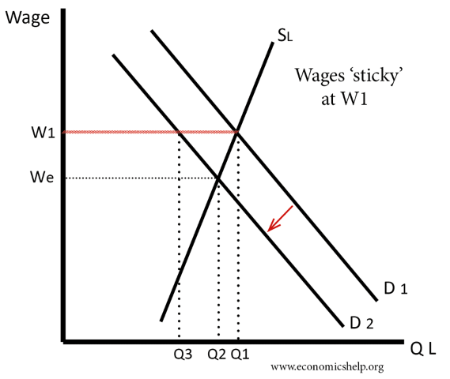

# Economics: the master of disaster

### Shenzhen Philosophy Group
#### May 16, 2020

---
## Contents

* The sun comes up: The world of today
* We plant some seeds
* We gird our loins
* Our real back-breaking toil for the day
* Everything goes wrong
* We find a solution
* We harvest our plants: A simple econ model
* Addendum

---
### Our new reality

----

----
#### But what IS THAT?

* Stock markets are hemmoraging cash, what does that mean?
* What is the stock market?
* Business? Finance? Economy?
* When are things going to go back to normal?

---
## Let's get this party started

### First, some ground rules

----
### There's just too much for me to cover here in two hours

Economics is really a broad topic, look to some book recommendations at the end
if you're interested in learning more

----
### Economics is inseparable from politics

#### We can acknowledge that connection exists, but we are not here to talk about that topic

----
### I'm talking (mostly) about what is, not what should be

> Positive statements vs normative statements

----
### Your spending is my income, and vice versa

> If we all save more, we all earn less

----
### Your debt is my asset, and vice versa

> Debts and assets (worldwide) sum to 0

----
## Money is payment, "thank you come again"

### Credit is a promise to make payment. It's less good

----
### Anyone can create money, the problem is getting it accepted

----
### Economics is a social science

Social science has a problem, you don't get to run large scale experiments (unless you have a navy)

----
### SS has only one proven tenet

> If a person's salary depends on them not understanding something, they'll find a way to do it

Upton Sinclair Principle

----
### Yes there is math involved, but it's not physics

Every action has a reaction, but Newton's Third Law does not apply. It's squishy.

----
### The language sets the field of battle

Don't debate economics using finance language, you'll lose

----
### Some definitions

* GDP - market value of goods and services
* Bank - an entity that borrows short and lends long
* Money - something that is accepted as payment
* Credit - a promise to make payment
* Stock - a partial share of company profits
* Bond - a promise to repay money X at time Y
* Interest rate - the cost of borrowing money
* Aggregate - you sum all the things

---
## Let's remember some guys

| Econ-type | What a normal day looks like |
|:---------|:-------------|
| Classical | Nothing, they're all dead      |
| Marxist   | Criticizing capitalism         |
| Freshwater| Writing papers, being rational |
| Saltwater | Writing papers with crazy hard math |
| Austrian  | Shitposting; no good scotsman |
| Behavioural | Doing experiments, writing papers |

----
### Classical (Neoclassical)
* David Ricardo
* Adam Smith
* Jean-Baptiste Say

----
### Marxist
* John Roemer
* David Harvey
* Nikolai Bukharin

----
### Chicago School (Monetarists, Freshwater)
* Milton Friedman
* George Stigler
* Eugene Fama

----
### Keynesian (New/Neo/Post-Keynesian)
* Paul Samuelson
* Joseph Stiglitz
* Paul Krugman

----
### Austrian (fixed exchange rate view)
* Carl Menger
* Ludwig von Mises
* Murray Rothbard
* Friedrich Hayek (sorta)

----
### Behavioural
* Dan Ariely
* Robert Thaler
* Amos Tversky and Daniel Kahneman

---
# Our Day's Labour

## Conquer Econ

###### Eeeppp
----
## Just another day of shit-posting on Reddit

Oh look, the topic is economics, I know a lot about economics - I OWN STOCK! I have a business degree.

----

----
### So we crack open our textbook, what do we find?

----
## Two separate things

| Macro | Micro |
|:------|:------|
| Domestic Economies  | Individual people/firms |
| Empirical/Keynesian-ish | Axiomatic/Neoclassical-ish  |
| Y = C + I + G + (X-M) | R = P * Q; MC = MR    |
| Aggregates          | Marginal                |
| Zoomed-out          | Zoomed-in               |

----
## Who are the agents?

* Households/individuals
* Firms/companies
* Governments
* Banks
* Other countries

----
##### LA weather, sunny all the time

----
## Let's set some bounds
#### Today I'll be talking about the period between 1907 and 2007

The story is the thing. Let's look at one.

----
### Dominant Modern Economics Eras

----
### 1812 - 1937 (approx)

* Economy is always at full-employment (model), defensible because of technology innovation
* Laissez-faire, limited government intervention
* Hard money (gold, cash redeemable)
* Say's Law, supply creates an equal amount of demand. AS = AD. Uh-oh

----
### The problem with Say's Law

* This is true in a barter economy 
* I produce goats and I trade a goat for 4 ducks. If no one wants goats I 
eat the goat and move to cows. No wasted production (more or less)
* But this isn't a barter economy, it's a money economy
* As the economy modernizes, production is not necessarily equal to buying power
* We need banks!

----
### We need a theory of money

* Gold (or silver...) imposes discipline on the economy, money is dear so use it wisely
* In times of trouble (war), countries demand elasticity (complicated)
* The textbook definition of money has 3 parts
1. Unit of account
2. Medium of exchange
3. Store of value

----
### That's a start, banking?

* Banks intermediate between people who have savings: depositors, and borrowers who want money to
finance an expansion of their business, tech upgrade, etc
* Banks make money on the spread - they pay their depositors 2% interest on the deposit, they charge 5% interest on the loan (simple model)
* Bank balance sheet: assets are loans, deposits are liabilities. Assets - liabilities = net worth

----
### Back to our story

* Early 20th century: banking is getting much more complicated!
* Commercial banks have capital requirements (reserves, quality), new types of financial companies are growing in popularity and they're giving customers a great deal
* Trusts! Give us your money, we invest it in the new sexy stock market and you'll get a big return!
* FINANCIAL INNOVATION NEVER FAILS!

----

----
### What's the effect?

* (Repeat) Bank Balance sheet: Assets - liabilities = net worth
* Trusts are important financial institutions, people have their savings there. If the assets drop far enough, the
bank folds and you lose all/most of your money
* Economic doctrine says: do nothing. Everything is assumed to be in equilibrium, and will surely return to equilbrium in no time. The theory isn't wrong, reality is wrong!

----
### System 1 - Classical

* Classical economics is in the saddle
* Starting to move away from gold-backed currency (US-1911(1971), England-1931, Germany-1931)
* World is pretty globalized, people move around
* Crises are quite common, public credit swamps the system (1873, 1907, 1929), no ability/theory to provide
monetary expansion to ease deflationary debt spiral
* The government shouldn't fix short-term shortfall in spending with fiscal policy, rational expectation theory (RET)

----
### What ends system 1?

###### Fascism

----
### 1937 - 1977

* We are now in the world that Keynes made
* Full employment in nearly all advanced countries
* Plenty of government spending on social welfare
* Tax rates high; unionization high; boring banks
* Globalization is down, economies are domestic
* Capital is in a box
* A chicken in every pot

----

----
### OK Boomer

* France -  Trente Glorieuses
* US - America, Fuck Yeah!
* Japan - Economic Miracle (teach your kids Japanese everyone)
* UK - The Golden Age
* Italy - il miracolo economico
* Russia - 7th and 8th year plans (then stagnation)

----
### Sounds good right?

Why aren't we in that system now?

----
### Capital goes on strike

* Productivity - doing more with less. The growth in income is shared between the owners and the workers
* Strong unions w/ tight labour markets. Worker's share of income is at all-time high
* 1970s - Oil Crisis, Vietnam, Global South independence movements

----
### The center cannot hold

* The post-War Bretton Woods institutions break
* 1971 (finished by 1974) the US closes the gold window
* Stagnation! High inflation, low/no growth economies
* Is this inflation purely a monetary phenomenon?

----
### Inflation

* Rising prices, have to give more money to get stuff
* Lowers the value of savings (money) over time
* All bad right?
* Spending = Income. Low inflation provides an incentive to spend in the short term
* Keynes = "In the long run we're all dead"

----

----

----
### Keynes' ghost is put to bed

* What runs the world: expectations runs the world!
* However expectations are unmeasurable, subjective and unpredictable, so they are hard to model
* 1970s capital stops investing at the same time as inflation is shooting to the sky
* Central banks kill the inflation by raising interest rates to the roof

----
### What ends system 2?

###### Thatcher, Reagan, Globalization

----
#### Here we go again

----
### Not junk bonds, high-yield bonds

* US central bank has large role in world economy, head central banker is the new rock-star 
* Inflationary expecations are broken by interest rates raised as high as ~15% in rich countries
* Re-globalization of economies due to opening of China/Mexico
* Marginal tax-rates cut especially for top earners

----

----
### Globalization is the story

* Capital has the whip hand once more
* Inflation is going down, but interest rates are going down less quickly
* Remember that stock market graph at the beginning?
* Bonds were sexy in the 1980s, leveraged buy-outs
* Bonds, Bonds? Not the stocks, not the stocks that I die for, you're asking about bonds?

----
### Remember system 1?

* Financial innovations lead to a debt deflation and JP Morgan bails the system
* This time we have the Fed, we have technology to move capital around every micro-second, and we're investing in capital goods all around the world
* Monetary discipline? Who cares, the world is desparate for dollars

----
### Remember bonds?

* Bonds are a fixed return security, you give me 98 and I'll pay you 100 next year
* 1980s the rates are still high, but I'm not giving you equity
* Greed is Good, but banks are boring

----
### I don't understand this world

----
### Drexel-Burnham is selling magic

* Junk bonds are the new magic money wand
* Interest payments are tax deductible, dividend payments are not
* Growing your company with banks is hard
* Growing your company with debt is cool
* Growing your company with equity is flexible

----
### Labour is in a box

----
### I'm no longer talking economics, I'm talking finance

* It's permanent crisis mode now
* If you don't like your wage we'll move your job to Mexico
* Corporate stucture is allowing innovation in what is essentially accounting fictions so that profits can be booked in offshore tax-havens
* Lean and mean times, maybe we should cut social spending

----
### What ended this system?

###### We bailed it out

---
## Past crises

| Episode            | CofG   | Effect       | Winner |
| -------- |-------|-------------|---------:|
| Panic of 1907 |US|Europe/Asia/Latin|Neoclassical |
| Great Depression |US|World|Keynesian |
| Oil Crisis |World|World|Freshwater |
| 1998 Asian  | Japan | DevelopingM | China    |
| 2008 GFC | US | World | Finance |

----
### Panic of 1907

- Financial innovation leads to speculative bubble
- No central bank, no ability to add liquidity to a seized payments system
- JP Morgan (Mr. Moneybags) bails out several trusts and forces bankers to pool funds to save the NYSE

----
The Panic of 1907 originated with runs on a type of financial intermediary that was mostly outside the payments system, trust companies.  Similar to modern “shadow” banks, trust companies grew rapidly and became important financial intermediaries in the years prior to the crisis.1  Less regulated than commercial banks, trust companies were highly levered, held low cash reserve balances, and issued uninsured liabilities.

- https://altcoopsys.org/wp-content/uploads/2016/11/Financial-Crisis-1907-Federal-Reserve-Act-JP-Morgan-Carola-Paper.pdf

----
### The fix is in

1913 Federal Reserve act creates the US Federal Reserve banks, 12 regional banks that act as a "lender of last resort"

----
### Lesson from 1907

> Lack of liquidity kills you quick

----
### Great Depression

- Speculative bubble in securities, crash in 1929
- Government pulls back spending post-crash
- Fear, retreat to safety. People hoard gold
- Gold rises in value, dis-inflation. Why spend today, when your money will buy more tomorrow?

----
### What about the Fed?

- Fed actions were uncoordinated
- Raised interest rates to kill stock speculation, leading to 
money scarcity (excess of discipline)
- Liquidationist policy: let bad institutions fail so that better insts can be created (Mellon)

----
 From the fall of 1930 through the winter of 1933, the money supply fell by nearly 30 percent. The declining supply of funds reduced average prices by an equivalent amount. This deflation increased debt burdens; distorted economic decision-making; reduced consumption; increased unemployment; and forced banks, firms, and individuals into bankruptcy. 

 - https://www.federalreservehistory.org/essays/great_depression

----
### The fix this time?

> WWII, ever heard of it?

----
### Lesson from the great depression

> An economic crisis can lead to a political crisis. Remember, in the long
run we're all dead

----
### Oil Crisis

- Post-war institutions breakdown, capital strike
- Strange combination of low growth, high inflation
- Capital goes on strike, why invest when there's no possiblity of a return?

----
### 1998 Asian Crisis

- Hot money comes in, hot money goes out
- US deficits down, no worldwide safe asset
- Money goes to Asian seeking big returns, things start to wobble
- Retreat to safety

---
### The greatest financial lesson of all time

> MONOPOLY

----
# TWISTED TO MY ENDS

----
### Game 1: A deflationary crash with no central bank

| Where | When | What's the problem? |
|:------:|:---------:|:------------:|
|US      | 1907      | Deflationary crash/speculation |

Everyone gets property, and a random amount of cash. There's a shock! There's deflation, money is going UP in value.
Stuff won't be higher in price later, stuff will be lower in price later AND your income is going down.

----
### Game 2: A deflationary crash with a central bank

| Where | When | What's the problem? |
|:------:|:---------:|:------------:|
|US      | 1932      | Deflationary crash/speculation |

Everyone is a bank! You have money inflows and money outflows, you pay out money in loans and receive money back (but some people are defaulting). Again - deflation! Banks have debt, and those debts are going UP in real value, the central bank can provide liquidity but can only pay out notes equal to 150% of it's gold.

----
### Game 3: An exchange rate crisis

| Where | When | What's the problem? |
|:------:|:---------:|:------------:|
|Thailand| 1997      | Capital flight/broken peg |

Everyone is a company! Hot money is coming in, everyone is buying Thai bonds are you are spending money on crazy
projects. You have lots of Thai cash, but you owe money denominated in USD. The government breaks the exchange rate peg, your debts become crazy expensive in local currency. Sell everything before it's too late.

---
# Reality Check

Remember the talk about the latest stock market crash. Watch MSNBC and 
they'll say that "wealth is being destroyed", is that right?

----
## Buyers and Sellers

* More people currently want to sell stocks than buy stocks: prices are down
* Companies have less working capital, sellers have more cash on hand
* The expected future profitability of stocks drops due to crash in the real economy (this time)

----

----
## Why does it matter?

* For most people, it simply doesn't
* Even for a particular company - they can fund themselves many different ways (stock market, bond market, bank loans, retained earnings, government handouts, etc)
* The stock market is huge and has a real consequence to the real economy, but it's not even the largest part of the capital market (which is itself much smaller than money markets)

----
#### Why do we think it matters then?

# How else do you keep everyone in a state of cat-like readiness?

----
#### What's the purpose of all this stuff?

With human nature being what it is: we are ultra-social primates with moral/cognitive empathy that dissipates as a function of social distance. We care about family, community, country, creed, and some vague notion of all being human, roughly in that order. What type of story do you need to tell in order to get people who have good technology allowing them to live the good life that they constantly need to kick mother nature (and your neighbour) in the face even more? What's the moral of the tale?

----
# Panic / Complacency

---
## Addendum

----
### Podcasts
* NPR Planet Money
* Freakonomics

### Youtube
* CrashCourse Economics
* New Economic Thinking (INet)

----
## Books/Authors

- __Mark Blyth__: political-economist. Austerity, Angrynomics. Plenty on youtube
- __Thomas Piketty__: historical-economist. Capital in the 21st Century, look up TED talks
- __David Graeber__: anthropoligist. Debt: The First 5000 Years, Bullshit Jobs
- __Ha Joon-Chang__: economist. 23 Things, Bad Samaritans
- __Milton Friendman__: economist. Free to Choose (book and TV series)

----
### What I was reading/watching while making this

- Robert Skidelsky - Money and Government
- Coursera: Money and Banking (be careful)
- arXiv.org
- Coursera: The Moral Foundations of Politics (Bentham, Marx, Smith, Mill)

----
## C.P. Snow, The Two Cultures

----
"The non-scientists have a rooted impression that the scientists are shallowly
optimistic, unaware of man's condition. On the other hand, the scientists believe
that the literary intellectuals are totally lacking in foresight, peculiarly
unconcerned with their brother men, in a deep sense anti-intellectual, anxious to
restrict both art and thought to the existential moment. And so on. Anyone with
a mild talent for invective could produce this kind of subterranean
back-chat. On each side there is some of it which is not entirely baseless. It is all
destructive. Much of it rests on misinterpretations which are dangerous."